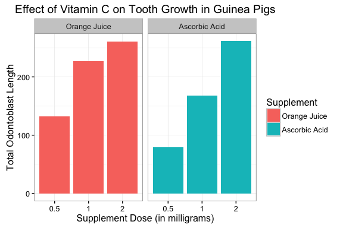
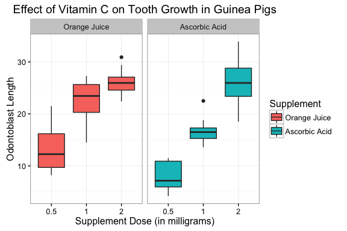

Effect of Vitamin C on Tooth Growth
--------

In this report, we will investigate the effect of Vitamin C on tooth
growth in guinea pigs using the `ToothGrowth` dataset in the R datasets
package. From the Help page for this dataset, we are told that there are
10 guinea pigs at each of three dose levels with each of two delivery
methods. However, the wording may imply to some that there are 10 guinea
pigs total in this study. Upon further investigation (resource link at
bottom), there are 60 guinea pigs in total. In addition, the resource
also clarifies that the `len` variable in this study refers to
odontoblasts, which are cells responsible for tooth growth, and not an
actual measured tooth length, which may be inferred from the Help page
description.

We are told that the dataset contains 60 observations of 3 variables:
`len`, `supp`, and `dose`, where `len` is the tooth length (units are
not specified), `supp` is the supplement type (either orange juice or
ascorbic acid), and `dose` is the dose in milligrams. So each guinea pig
belongs to one of the following test groups: {(0.5 mg, Orange Juice),
(1.0 mg, Orange Juice), (2.0 mg, Orange Juice), (0.5 mg, Ascorbic Acid),
(1.0 mg, Ascorbic Acid), (2.0 mg, Ascorbic Acid)}.

In review, before we even look at the data, we know that this dataset
will contain 60 observations of a cell measurement that were taken in
response to one of three doses of vitamin C, by one of two delivery
methods.

Exploratory Data Analysis
-------------------------

Let's first get a feel for the data:

    str(ToothGrowth)

    ## 'data.frame':    60 obs. of  3 variables:
    ##  $ len : num  4.2 11.5 7.3 5.8 6.4 10 11.2 11.2 5.2 7 ...
    ##  $ supp: Factor w/ 2 levels "OJ","VC": 2 2 2 2 2 2 2 2 2 2 ...
    ##  $ dose: num  0.5 0.5 0.5 0.5 0.5 0.5 0.5 0.5 0.5 0.5 ...

Here we can see that the data is stored in a data frame with 60 rows and
3 columns. The `len` and `dose` fields are numeric and the `supp`
variable is a factor with 2 levels: OJ and VC.

Let's look at some of the properties of the numeric data:

    range(ToothGrowth$dose)

    ## [1] 0.5 2.0

    unique(ToothGrowth$dose)

    ## [1] 0.5 1.0 2.0

    range(ToothGrowth$len)

    ## [1]  4.2 33.9

So for the `dose` variable, the data values are either 0.5, 1.0, or 2.0.
The `len` field, which represents the length of tooth, ranges from 4.2
to 33.9.

Since there are only three dose levels and 2 supp factors, we can easily
view the resulting length for all 6 combinations of the two by plotting
the dose versus length for each supp factor using the following snippet:

        # load the libraries
        library(datasets)
        library(ggplot2)

    ## Warning: package 'ggplot2' was built under R version 3.2.3

        # rename the factor levels
        levels(ToothGrowth$supp) <- c("Orange Juice", "Ascorbic Acid")
        # plot the data using facets
        ggplot(ToothGrowth, aes(as.factor(dose), len, fill=supp)) +
            theme_bw() +
            geom_bar(stat="identity") +
            facet_grid(. ~ supp) +
            labs(x = "Supplement Dose (in milligrams)", y = "Total Odontoblast Length",
            title="Effect of Vitamin C on Tooth Growth in Guinea Pigs") +
            guides(fill = guide_legend(title="Supplement"))

The plot above gives us the total length of odontoblasts from the 10
test subjects in each of the 6 test groups.

Let's also look at a summary of lengths for each test group:

Inferential Analysis
--------------------

Now, we would like to use our statistical inference knowledge to gain
some insights into what this data means. First, we note that we cannot 
pair the data since we have 60 subjects in a test group with no control 
or baseline data. Therefore, we cannot compare supplement versus no 
supplement. Since we have various levels of supplement and 2 sources, 
we are left with options of comparing effects of different doses of 
supplements or different types of supplements. The plots above suggest 
that forming a test hypothesis with respect to dose may be more relevant. 
That is, we can see a significant effect for each
dose level in both supplements, but the effect by supplement type is
less distinct. However, we will also break down our analysis by
supplement type to account for the variation.

Assuming that increased odontoblast length is desirable in guinea pigs,
we now want to use the data from this to decide whether there is
evidence to support the claim that administering a higher dose of
Vitamin C to guinea pigs will increase odontoblast length. We will
construct a separate test hypothesis for each supplement type.

### Orange Juice Supplement

In this section, we compare the effect of the highest dose of Vitamin C
from orange juice to the lowest dose of Vitamin C from orange juice.

Null Hypothesis - Odontoblast length is not affected by the dose of
Vitamin C from orange juice.

Alternative Hypothesis - Odontoblast length is affected by the dose of
Vitamin C from orange juice.

For the test statistic, we will compare the mean odontoblast length from
the (0.5 mg, Orange Juice) group to the (2.0 mg, Orange Juice) group.

Let mu.5 be the average odontoblast length for the (0.5 mg,
Orange Juice) test group and let mu2 be the average
odontoblast length for the (2.0 mg, Orange Juice) test group. Then,

H0: mu.5 == mu2

Ha: mu.5 != mu2

Since the sample size is small, we will perform 95% confidence interval
t-test to determine whether or not to reject the null hypothesis in
favor of increasing Vitamin C consumption from orange juice. It should
also be noted that we may assume unequal variance. As previously
mentioned, we assume the groups are independent (not paired).

The rejection region includes both tails and is therefore two-sided
since we will reject the null hypothesis if the test statistic is
smaller or greater than the confidence interval boundaries.

Perform the t-test:

        # extract the len column for the 0.5mg, OJ test group
        lowestDose <- subset(ToothGrowth, dose == .5 & supp == "Orange Juice", 1)
        # extract the len column for the 2.0mg, OJ test group
        highestDose <- subset(ToothGrowth, dose == 2.0 & supp == "Orange Juice", 1)
        #perform the T-Test
        t.test(highestDose, lowestDose, paired = FALSE, alternative="two.sided")

    ## 
    ##  Welch Two Sample t-test
    ## 
    ## data:  highestDose and lowestDose
    ## t = 7.817, df = 14.668, p-value = 1.324e-06
    ## alternative hypothesis: true difference in means is not equal to 0
    ## 95 percent confidence interval:
    ##   9.324759 16.335241
    ## sample estimates:
    ## mean of x mean of y 
    ##     26.06     13.23

We see that test statistic is 7.817, which is not within the 95%
confidence interval, so we reject the null hypothesis in favor of the
alternative hypothesis that odontoblast length is affected by the dose
of Vitamin C from orange juice.

### Ascorbic Acid Supplement

In this section, we compare the effect of the highest dose of Vitamin C
from ascorbic acid to the lowest dose of Vitamin C from ascorbic acid.

Null Hypothesis - Odontoblast length is not affected by the dose of
Vitamin C from ascorbic acid.

Alternative Hypothesis - Odontoblast length is affected by the dose of
Vitamin C from ascorbic acid.

For the test statistic, we will compare the mean odontoblast length from
the (0.5 mg, Ascorbic Acid) group to the (2.0 mg, Ascorbic Acid) group.

Let mu.5 be the average odontoblast length for the (0.5 mg,
Ascorbic Acid) test group and let mu2 be the average
odontoblast length for the (2.0 mg, Ascorbic Acid) test group. Then,

H0: mu.5 == mu2

Ha: mu.5 != mu2

Since the sample size is small, we will perform 95% confidence interval
t-test to determine whether or not to reject the null hypothesis in
favor of increasing Vitamin C consumption from ascorbic acid. It should
also be noted that we may assume unequal variance. As previously
mentioned, we assume the groups are independent (not paired).

The rejection region includes both tails and is therefore two-sided
since we will reject the null hypothesis if the test statistic is
smaller or greater than the confidence interval boundaries.

Perform the t-test:

        # extract the len column for the 0.5mg, VC test group
        lowestDose <- subset(ToothGrowth, dose == .5 & supp == "Ascorbic Acid", 1)
        # extract the len column for the 2.0mg, VC test group
        highestDose <- subset(ToothGrowth, dose == 2.0 & supp == "Ascorbic Acid", 1)
        #perform the T-Test
        t.test(highestDose, lowestDose, paired = FALSE, alternative="two.sided")

    ## 
    ##  Welch Two Sample t-test
    ## 
    ## data:  highestDose and lowestDose
    ## t = 10.388, df = 14.327, p-value = 4.682e-08
    ## alternative hypothesis: true difference in means is not equal to 0
    ## 95 percent confidence interval:
    ##  14.41849 21.90151
    ## sample estimates:
    ## mean of x mean of y 
    ##     26.14      7.98

We see that test statistic is 10.388, which is not within the 95%
confidence interval, so we reject the null hypothesis in favor of the
alternative hypothesis that odontoblast length is affected by the dose
of Vitamin C from ascorbic acid.

Since both tests support rejecting the null hypothesis, perhaps a test
for the different supplements is warranted after all. Perhaps ascorbic
acid is not as available as orange juice, or much more costly, we may
want to know if there is evidence in support of choosing ascorbic acid
instead of orange juice.

### Supplement Type

Assuming we want to maximize odontoblast cell length, we will test the
2.0 mg data for both supplement types. For the test statistic, we will
compare the mean odontoblast length from the (2.0 mg, Ascorbic Acid)
group to the (2.0 mg, Orange Juice) group.

Our null hypothesis is that odontoblast length is not affected by the
Vitamin C supplement type, while the alternative hypothesis claims that
odontoblast length is affected by the Vitamin C supplement type.

Let muVC be the average odontoblast length for the (2.0 mg,
Ascorbic Acid) test group and let muOJ be the average
odontoblast length for the (2.0 mg, Orange Juice) test group. Then,

H0: muVC == muOJ

Ha: muVC != muOJ

Again, since the sample size is small, we will perform 95% confidence
interval t-test to determine whether or not to reject the null
hypothesis. We again assume unequal variance between the independent
groups.

Again, the rejection region includes both tails and is therefore
two-sided since we will reject the null hypothesis if the test statistic
is smaller or greater than the confidence interval boundaries.

Perform the t-test:

        # extract the len column for the 2.0mg, VC test group
        vcSupplement <- subset(ToothGrowth, dose == 2.0 & supp == "Ascorbic Acid", 1)
        # extract the len column for the 2.0mg, OJ test group
        ojSupplement <- subset(ToothGrowth, dose == 2.0 & supp == "Orange Juice", 1)
        #perform the T-Test
        t.test(vcSupplement, ojSupplement, paired = FALSE, alternative="two.sided")

    ## 
    ##  Welch Two Sample t-test
    ## 
    ## data:  vcSupplement and ojSupplement
    ## t = 0.046136, df = 14.04, p-value = 0.9639
    ## alternative hypothesis: true difference in means is not equal to 0
    ## 95 percent confidence interval:
    ##  -3.63807  3.79807
    ## sample estimates:
    ## mean of x mean of y 
    ##     26.14     26.06

Here we see that the test statistic is 0.046, which is within the 95%
confidence interval, so we would fail to reject the null hypothesis in
favor of the alternative hypothesis. Furthermore, we can observe the
sample means in the output: 26.14 and 26.06, which are very similar in
value.

Conclusion
----------

Assuming we are testing whether the dose of Vitamin C has an effect on
the length of odontoblast cells in guinea pigs, we conclude that an
increased dose of Vitamin C from either orange juice or ascorbic acid
does have a significant effect. For both sources, the test statistic
resulting from a two-sided, two-sample t-test was not within the 95%
confidence interval indicting that we should reject the null hypothesis
for both tests.

After further testing of the 2.0 mg doses for both supplements, there is
no evidence to support prefering one suplement type over the other.
Therefore, if orange juice is a more appealing supplement source, we
would not observe longer odontoblast cells by switching to ascorbic
acid.

Resources
---------

Link to description of the ToothGrowth dataset, which specifies there
are 60 guinea pigs in this study
<https://stat.ethz.ch/R-manual/R-devel/library/datasets/html/ToothGrowth.html>
